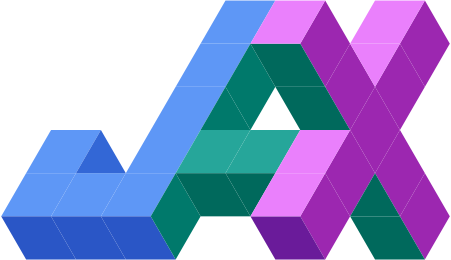

<link href="https://fonts.googleapis.com/css2?family=Outfit:wght@700;800;900&display=swap" rel="stylesheet">

<canvas id="shapix-logo" width="200" height="200"></canvas>

Shapix

Runtime shape checking for the array age

Elegant shape and dtype validation for NumPy, JAX, and PyTorch arrays — powered by <a href="https://github.com/beartype/beartype" class="beartype-link">beartype</a>.

<a href="getting-started/" class="md-button md-button--primary">Get Started</a>
<a href="api/" class="md-button">API Reference</a>
<a href="https://github.com/acecchini/shapix" class="md-button">GitHub</a>

### :material-lightning-bolt: Zero Boilerplate

Works with standard `@beartype` decorators and `beartype.claw` import hooks. No custom decorator required.

### :material-link-variant: Cross-Argument Consistency

Named dimensions are enforced across all parameters and the return value within a single function call.

### :material-check-decagram: Static Type Checker Friendly

Under `TYPE_CHECKING`, array types resolve to proper `NDArray` / `Array` / `Tensor` aliases. Works with pyright, mypy, and ty.

### :material-book-open-variant: Readable Annotations

`F32[N, C, H, W]` reads like documentation. No string parsing, no magic syntax.

### :material-cog: Full BeartypeConf Support

Unlike jaxtyping, shapix doesn't replace your beartype configuration. Full `BeartypeConf` support out of the box.

### :material-shield-lock: Thread-Safe

Each thread gets independent dimension bindings via `threading.local()`. Safe for parallel workloads.

Supported Backends

<a href="https://numpy.org/doc/stable/" class="backend-logo backend-logo--numpy" target="_blank" rel="noopener">
<svg viewBox="0 0 24 24" fill="#4DABCF"><path d="M10.315 4.876L6.3048 2.8517l-4.401 2.1965 4.1186 2.0683zm1.8381.9277l4.2045 2.1223-4.3622 2.1906-4.125-2.0718zm5.6153-2.9213l4.3193 2.1658-3.863 1.9402-4.2131-2.1252zm-1.859-.9329L12.021 0 8.1742 1.9193l4.0068 2.0208zm-3.0401 16.7443V24l4.7107-2.3507-.0053-5.3085zm4.7037-4.2057l-.0052-5.2528-4.6985 2.3356v5.2546zm5.6553-.9845v5.327l-4.0178 2.0052-.0029-5.3028zm0-1.8626V6.4214l-4.0253 2.001.0034 5.2633zM11.2062 11.571L8.0333 9.9756v6.895s-3.8804-8.2564-4.2399-8.998c-.0463-.0957-.2371-.2007-.2858-.2262C2.8118 7.2812.773 6.2485.773 6.2485V18.43l2.8204 1.5076v-6.3674s3.8392 7.3775 3.878 7.458c.0389.0807.4245.8582.8362 1.1314.5485.363 2.8992 1.7766 2.8992 1.7766z"/></svg>
NumPy
</a>

<a href="https://jax.readthedocs.io/" class="backend-logo backend-logo--jax" target="_blank" rel="noopener">

JAX
</a>

<a href="https://pytorch.org/docs/stable/" class="backend-logo backend-logo--torch" target="_blank" rel="noopener">
<svg viewBox="0 0 24 24" fill="#EE4C2C"><path d="M12.005 0L4.952 7.053a9.865 9.865 0 000 14.022 9.866 9.866 0 0014.022 0c3.984-3.9 3.986-10.205.085-14.023l-1.744 1.743c2.904 2.905 2.904 7.634 0 10.538s-7.634 2.904-10.538 0-2.904-7.634 0-10.538l4.647-4.646.582-.665zm3.568 3.899a1.327 1.327 0 00-1.327 1.327 1.327 1.327 0 001.327 1.328A1.327 1.327 0 0016.9 5.226 1.327 1.327 0 0015.573 3.9z"/></svg>
PyTorch
</a>

<a href="https://optree.readthedocs.io/" class="backend-logo backend-logo--optree" target="_blank" rel="noopener">
<svg viewBox="0 0 24 24" fill="#4CAF50"><path d="M17 16l-4-4V8.82C14.16 8.4 15 7.3 15 6c0-1.66-1.34-3-3-3S9 4.34 9 6c0 1.3.84 2.4 2 2.82V12l-4 4H3v5h5v-3.05l4-4.2 4 4.2V21h5v-5h-4z"/></svg>
OpTree
</a>

